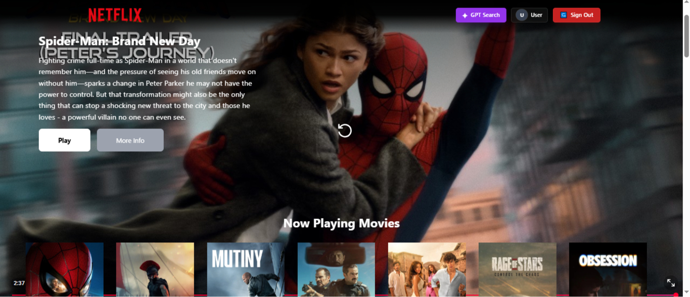
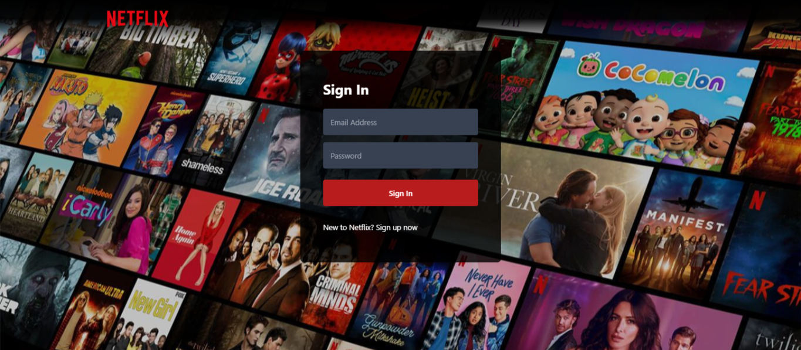
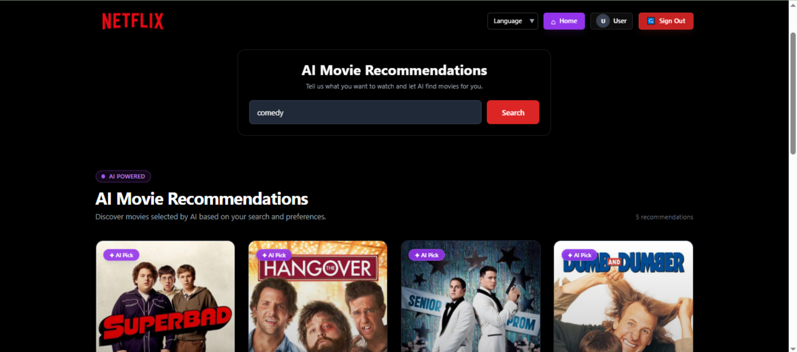

# 🎬 Movie Guide App

A modern **AI-powered movie discovery and recommendation web application** built with React. Users can explore movies, search for personalized recommendations using AI, and securely authenticate using Firebase.

## 🚀 Live Demo

🔗 **[Visit Movie Guide App](https://movie-guide-app-8jy5.vercel.app/browse)**

## 🔑 Test Credentials

Use the following credentials to access the application:

Email: test@example.com
Password: Test@123456

These credentials are provided for demo and testing purposes.

## 📸 Screenshots

### Home / Browse



### Login



### AI Movie Search



---

## ✨ Features

- 🔐 **Firebase Authentication**
  - User registration
  - Email/password login
  - Logout
  - Authentication state persistence

- 🎬 **Movie Discovery**
  - Now Playing movies
  - Popular / Trending movies
  - Movie posters and descriptions
  - Movie trailers using TMDB video API

- 🤖 **AI Movie Recommendations**
  - Enter natural-language movie preferences
  - AI generates personalized movie recommendations
  - Automatically searches recommended movies using TMDB

- 🌍 **Multi-language Support**
  - Search interface available in multiple languages
  - Language preference managed through Redux

- 🔎 **Movie Search**
  - Search movies based on user preferences
  - Dynamic movie results

- 📱 **Responsive UI**
  - Mobile-friendly design
  - Tablet and desktop layouts
  - Responsive movie grids and navigation

- ⚡ **State Management**
  - Redux Toolkit
  - Centralized movie, user, GPT, and configuration state

- ☁️ **Deployment**
  - Production deployment with Vercel

---

## 🛠️ Tech Stack

### Frontend

- React 18
- React Router
- Tailwind CSS
- JavaScript (ES6+)

### State Management

- Redux
- Redux Toolkit
- React Redux

### APIs & Services

- TMDB API
- Firebase Authentication
- Puter AI

### Build & Deployment

- Create React App
- Vercel
- Git & GitHub

---

## 🏗️ Application Architecture

```text
Movie Guide App
│
├── Authentication
│   ├── Login
│   ├── Signup
│   └── Firebase Authentication
│
├── Browse
│   ├── Main Container
│   ├── Movie Lists
│   ├── Now Playing
│   ├── Popular Movies
│   └── Movie Trailers
│
├── AI Movie Search
│   ├── User Prompt
│   ├── AI Recommendation
│   ├── Movie Name Extraction
│   └── TMDB Search
│
└── State Management
    ├── User Slice
    ├── Movies Slice
    ├── GPT Slice
    └── Configuration Slice
```

---

## 📂 Project Structure

```text
src/
│
├── components/
│   ├── Browse.jsx
│   ├── Header.jsx
│   ├── Login.jsx
│   ├── GPTSearch.jsx
│   ├── GPTSearchBar.jsx
│   ├── GPTMovieSuggestions.jsx
│   ├── MainContainer.jsx
│   └── SecondaryContainer.jsx
│
├── hooks/
│   ├── useGetKey.jsx
│   ├── useNowPlayingMovies.jsx
│   └── useTrendingMovies.jsx
│
├── utils/
│   ├── Firebase.js
│   ├── Constants.js
│   ├── Validate.jsx
│   ├── moviesSlice.js
│   ├── userSlice.js
│   ├── gptSlice.js
│   └── configSlice.js
│
└── App.js
```

---

## 🔐 Authentication

Firebase Authentication is used for secure user authentication.

The application supports:

```text
Signup
   ↓
Firebase Authentication
   ↓
Login
   ↓
Authentication State
   ↓
Browse Page
```

Firebase's `onAuthStateChanged` listener keeps the application synchronized with the user's authentication state.

---

## 🤖 AI Recommendation Flow

The AI movie recommendation system works in the following way:

```text
User enters movie preference
          ↓
       AI Search
          ↓
AI generates movie names
          ↓
Parse movie names
          ↓
Remove duplicates
          ↓
Search TMDB API
          ↓
Movie Results
          ↓
Display Recommendations
```

Example:

```text
"Recommend some action movies with time travel"
```

The AI generates movie names, which are then searched through TMDB to retrieve posters, descriptions, release dates, and other movie information.

---

## 🎥 Movie Data

Movie information is retrieved from **The Movie Database (TMDB)** API.

The application uses TMDB for:

- Movie search
- Popular movies
- Now playing movies
- Movie posters
- Movie descriptions
- Release dates
- Movie videos/trailers

---

## ⚙️ Installation

### 1. Clone the repository

```bash
git clone https://github.com/Musaib-Naseem/Movie-Guide-App.git
```

### 2. Navigate to the project

```bash
cd Movie-Guide-App
```

### 3. Install dependencies

```bash
npm install
```

### 4. Start the development server

```bash
npm start
```

The application will run at:

```text
http://localhost:3000
```

---

## 🔑 Environment Variables

Create a `.env` file in the project root.

Example:

```env
REACT_APP_TMDB_API_KEY=your_tmdb_api_key
```

---

## 🏗️ Production Build

Create an optimized production build:

```bash
npm run build
```

The production files will be generated in:

```text
build/
```

---

## 🚀 Deployment

The application can be deployed using Vercel.

Typical deployment flow:

```text
Local Development
       ↓
Git Commit
       ↓
Git Push
       ↓
GitHub
       ↓
Vercel
       ↓
Production
```

Every push to the configured GitHub branch can trigger a new Vercel deployment.

---

## 🧠 Key React Concepts Used

This project demonstrates practical usage of:

- Functional Components
- React Hooks
- `useState`
- `useEffect`
- `useRef`
- Custom Hooks
- React Router
- Redux Toolkit
- Redux Selectors
- Protected authentication flow
- API integration
- Async/Await
- Promise handling
- Conditional rendering
- Responsive UI
- Component-based architecture

---

## 🔒 Security Considerations

- Firebase handles authentication securely.
- API credentials should be stored using environment variables where appropriate.
- Sensitive credentials should never be committed to GitHub.
- Authentication state is managed through Firebase's authentication listener.

---

## 📈 Future Improvements

Potential improvements include:

- ⭐ Add movie ratings
- ❤️ Add favorites / watchlist
- 🔍 Advanced movie filtering
- 🎭 Genre-based recommendations
- 👤 User profile management
- 📱 Progressive Web App support
- 🎞️ Movie details page
- 🧪 Unit and integration testing
- ⚡ Further performance optimization
- 🌙 Dark/light theme support

---

## 👨‍💻 Author

**Musaib Naseem**

Frontend Developer focused on building modern, scalable React applications.

### Technologies

`React` `JavaScript` `Redux Toolkit` `Tailwind CSS` `Firebase` `REST APIs` `AI` `Git` `GitHub`

---

## ⭐ Support

If you find this project useful, consider giving the repository a ⭐ on GitHub.

---

## 📄 License

This project is created for learning and portfolio purposes.
